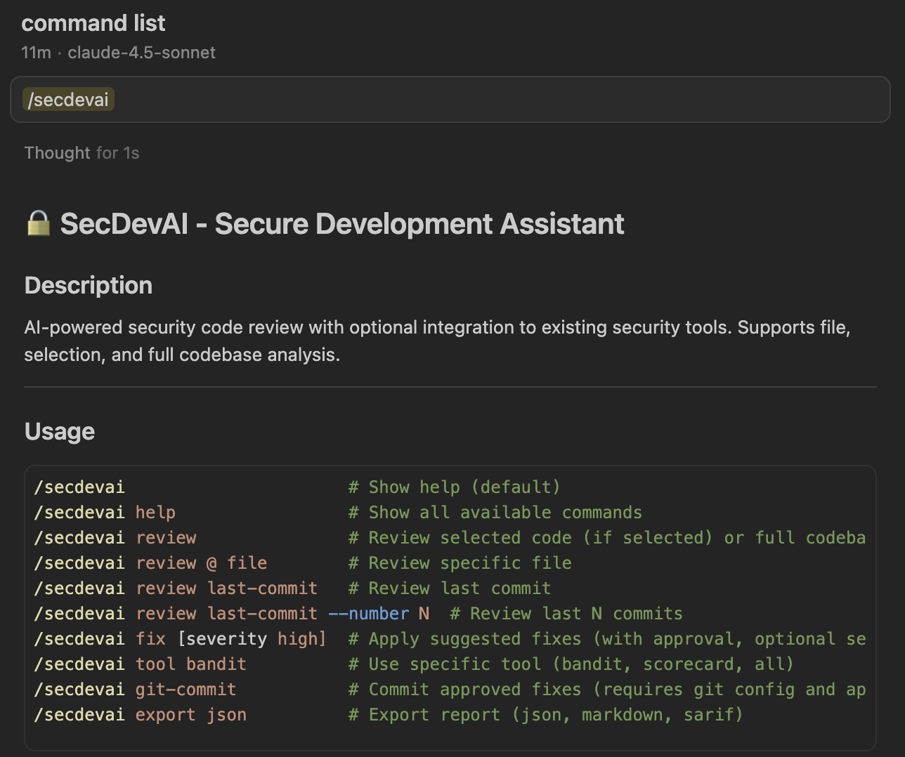

# SecDevAI - Secure Development Assistant Skills Package

Stop shipping security vulnerabilities. Start Secure Development right now with instant security reviews and fix suggestions right in your preferred AI coding assistant!

SecDevAI provides context-aware security analysis and powerful features for Cursor, Claude Code, and Gemini CLI through simple slash commands.

> [!WARNING]
> **SecDevAI is currently in active development**. Features, interfaces and behavior may change without notice. Use at your own risk and please report any issues you encounter. Contribution is more than welcome!

## Quick Start in 1 Minute

0. Move to your project 

```bash
cd your-code-project
```

1. Install SecDevAI with a single command


Install the latest SecDevAI context directly from GitHub([`uv`](https://github.com/astral-sh/uv) is required.):
```bash
uvx git+https://github.com/RedHatProductSecurity/secdevai.git
```

Alternatively, install the SecDevAI command in your system and run `secdevai` in your project.
```bash
uv tool install git+https://github.com/RedHatProductSecurity/secdevai.git
```
```bash
secdevai
```

2. Run your preferred AI tool (e.g., Claude Code, Cursor, Gemini-CLI) and type `/secdevai`



That's it! Try using the available commands. See also [Usage Guide](docs/USAGE.md) for more information.

## Overview

SecDevAI is an AI-powered secure development assistant that helps developers and security researchers build secure code. It provides security analysis with optional integration to existing security tools, supporting both targeted file/selection reviews and full codebase scans. The tool includes extensible rules covering OWASP Top 10 and common code patterns, making it valuable for both development teams and security researchers analyzing codebases and identifying vulnerabilities.


## Why SecDevAI?

While you can ask standard Cursor, Claude Code, or Gemini CLI for code review, SecDevAI provides **transparency and control** over the security review contexts. This allows you to:

- **Transparency**: See exactly which security patterns and rules are applied to your code.
- **Control**: Customize and extend security contexts to fit your organization's specific needs.
- **Continuous Improvement**: Update and refine security review contexts based on your team's experience and evolving threats.

This approach enables you to continually improve the quality of security review results, rather than relying on opaque, fixed AI models that cannot be modified or enhanced.

## Features

- **Multi-Platform**: Works across Cursor, Claude Code, and Gemini CLI
- **Security Review**: Analyze codebases for vulnerabilities with OWASP Top 10 coverage
- **Tool Integration**: Optional integration with Bandit, Scorecard, and more
- **Extensibility**: Customizable security rules and patterns for any language
- **Remediation**: AI-powered code fix suggestions with approval workflow


## Project Structure

```
secdevai/
├── lola-module/              # Lola AI Context Module (skills & contexts)
│   └── skills/              # Security skills
│       ├── secdevai/        # Main entry point skill
│       ├── secdevai-review/ # Security review skill (with context files)
│       ├── secdevai-fix/    # Fix suggestion skill
│       ├── secdevai-help/   # Help skill
│       └── secdevai-tool/   # Tool integration skill (with scripts)
├── src/secdevai_cli/         # CLI implementation
└── docs/                     # Documentation
```

## Next Steps
- Read [Usage Guide](docs/USAGE.md) to get started and explore all features
- Read [Contributing Guide](CONTRIBUTING.md) to customize rules and contribute

## Troubleshooting

### Command not found
- Make sure SecDevAI is installed: `secdevai --help`
- For `uv`, ensure `~/.local/bin` is in your PATH

### Platform not detected
- SecDevAI defaults to Cursor if no platform directories (`.cursor/`, `.claude/`, `.gemini/`) are detected
- If you want commands for Claude or Gemini, create the platform directory first:
  ```bash
  mkdir -p .claude  # Creates .claude/ directory
  secdevai          # Will now detect and deploy to .claude/commands/
  ```
- **Note:** Gemini CLI uses `.toml` format, so commands in `.gemini/commands/` will have `.toml` extension, while Cursor and Claude use `.md` format
- Alternatively, manually create the commands directories after initialization:
  ```bash
  mkdir -p .claude/commands .gemini/commands
  cp .cursor/commands/* .claude/commands/  # Works for Claude (same .md format)
  # For Gemini, you'll need to convert .md to .toml format manually
  ```
  
## License

This project is licensed under the MIT [License](LICENSE)

## Contributing

We welcome contributions! The main ways to contribute are by updating or adding more contexts into the **`lola-module/`** directory and/or **skills**.

- **`lola-module/`**: Follows the [Lola AI Context Module](https://github.com/RedHatProductSecurity/lola) pattern for packaging and distributing AI skills across multiple assistants.
- **Skills**: Follow the [Agent Skills](https://platform.claude.com/docs/en/agents-and-tools/agent-skills/overview) pattern for writing effective `SKILL.md` files.

See [CONTRIBUTING.md](CONTRIBUTING.md) for more details.

